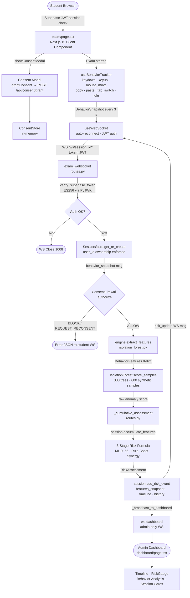

# ExamShield

## 1. One-Line Description

ExamShield is a privacy-first, AI-powered exam integrity platform that streams behavioral telemetry from the student's browser to a real-time risk engine, surfacing anomalies to an authenticated admin dashboard — without webcams, audio surveillance, or keylogging.

---

## 2. Problem Statement

Traditional online proctoring relies on invasive surveillance: webcam feeds, microphone access, screen recording, and third-party software locks. These approaches carry significant privacy costs, create inequitable conditions for students with limited hardware, and produce alert fatigue through false positives. Meanwhile, the core problem remains unsolved — a student who knows the camera is watching can still look up answers on a phone.

**Behavioral signals offer a complementary, less invasive signal.** Unusual typing rhythms, copy-paste activity, repeated tab switches, and extended idle periods are detectable entirely within the browser, require no hardware permissions beyond a standard webpage, and generate a real-time risk profile that an examiner can act on.

ExamShield is designed around the proposition that *behavioral anomaly scoring with explicit student consent* is a meaningful and ethically defensible tool — not a replacement for human judgement, but a way to direct examiner attention to sessions that warrant a closer look.

---

## 3. Solution

ExamShield captures behavioral telemetry passively during an exam (the student has explicitly consented before any monitoring begins), streams it over an authenticated WebSocket every 3 seconds, and runs it through a hybrid risk engine — an unsupervised Isolation Forest model combined with deterministic rule boosts — to produce a cumulative risk score for each session.

Key design decisions:

- **Consent-first.** No monitoring begins until the student has actively granted consent through a modal that records a structured `ConsentRecord`. A consent firewall checks every behavior analysis against the frozen original consent before processing.
- **No webcam, no audio, no screen capture.** All data is collected via standard browser event listeners on a web page the student navigates to voluntarily.
- **Keys are anonymized.** The hook captures that a key was pressed, not which key — only `'char'` or a special key name is recorded.
- **Scores are cumulative, not per-window.** A paste event at the start of the exam still factors into the risk score at the end.
- **Scores inform, not decide.** The system produces a risk level (low / medium / high) and a forensic timeline. A human examiner decides what, if anything, to do.

---

## 4. Core Features

Features listed here are implemented and running in the current codebase.

| Feature | Status |
|---|---|
| Browser-native behavioral telemetry (keystrokes, mouse, copy/paste, tab switches, idle) | ✅ Implemented |
| 3-second streaming WebSocket pipeline from browser to backend | ✅ Implemented |
| Supabase JWT authentication for students and admins | ✅ Implemented |
| Per-session cross-user isolation enforced at every WebSocket message | ✅ Implemented |
| Isolation Forest anomaly scoring (300 trees, 8 features) | ✅ Implemented |
| Deterministic rule boosts for high-signal events | ✅ Implemented |
| 3-stage cumulative risk formula | ✅ Implemented |
| Session-wide telemetry accumulation (11 accumulators) | ✅ Implemented |
| Consent firewall with Consent Shadow (original_context immutability) | ✅ Implemented |
| Consent drift detection (ALIGNED / MINOR_DRIFT / SIGNIFICANT_DRIFT / CONSENT_INVALID) | ✅ Implemented |
| Real-time admin dashboard over authenticated WebSocket | ✅ Implemented |
| Forensic timeline with semantic event types (paste/copy/tab_switch) | ✅ Implemented |
| Risk gauge, risk history, behavior analysis report on dashboard | ✅ Implemented |
| Admin user management (list/create admins via Supabase Auth Admin API) | ✅ Implemented |
| 30-minute, 5-question long-answer exam experience | ✅ Implemented |
| 138 passing backend tests across 9 test modules | ✅ Implemented |

---

## 5. How It Works

The full pipeline from student action to admin alert:

```
Student opens /exam
  → Supabase JWT session validated (middleware.ts)
  → Consent modal presented (exam/page.tsx)
  → Student grants consent → POST /api/consent/grant
  → ConsentRecord created with frozen original_context (Consent Shadow)

Exam begins
  → useBehaviorTracker hook attaches event listeners
  → Events buffered: keydown, keyup, mousemove, copy, paste,
    visibilitychange, blur, idle_start/idle_end
  → Every 3 seconds: BehaviorSnapshot flushed

WebSocket transport (useWebSocket hook)
  → Connects to ws://{backend}/ws/{session_id}?token={JWT}
  → Sends session_start on connect, then behavior_snapshot every 3 s
  → Exponential back-off reconnect (max 5 attempts)

Backend WebSocket handler (routes.py — exam_websocket)
  → verify_supabase_token: ES256 JWT verified via Supabase JWKS
  → SessionStore.get_or_create: session bound to user_id
  → User-ID ownership checked on every incoming message

Consent Firewall (consent_firewall.py)
  → firewall.authorize() checks original_context (frozen at grant time)
  → Decisions: ALLOW / REQUEST_RECONSENT / BLOCK
  → On BLOCK: error JSON returned to student WebSocket

Feature extraction (isolation_forest.py — extract_features)
  → 8 features computed from the event buffer:
    typing_speed, average_key_interval, key_variance,
    mouse_activity, idle_duration, tab_switch_count,
    copy_count, paste_count

Isolation Forest scoring
  → IsolationForest(n_estimators=300, contamination=0.08)
  → Raw score mapped to 0–55 via piecewise linear percentile bucketing

Cumulative accumulation (routes.py — _cumulative_assessment)
  → session.accumulate_features() merges window into 11 session-wide totals
  → Cumulative BehaviorFeatures fed back through the risk formula

3-Stage risk formula
  → Stage 1 (ML): Isolation Forest score 0–55
  → Stage 2 (Rules): deterministic boosts (paste → up to 84, tab → up to 62)
  → Stage 3 (Synergy): +10 if ml > 35 AND rule > 60 (cap 99)

Session state update (session.add_risk_event)
  → features_snapshot ← cumulative feature dict
  → risk_history ← appended
  → timeline ← window-scoped flags only (no duplicate re-entries)
  → risk_update JSON sent back to student WebSocket

Admin broadcast (_broadcast_to_dashboard)
  → session.to_dict() pushed to all /ws-dashboard listeners
  → Dashboard updates live: RiskGauge, timeline, behavior analysis
```

---

## 6. System Architecture



---

## 7. Behavioral Intelligence

All telemetry is collected via standard browser event listeners. No extensions, plugins, or hardware permissions are required.

### Typing Telemetry
`keydown` and `keyup` events are captured via `document.addEventListener`. The `keydown` handler records the time elapsed since the previous keystroke (`interval_since_last` from a ref). Only `'char'` (for printable characters) or the key name (e.g. `'Backspace'`) is recorded — the actual character typed is never captured. This feeds three features: **typing_speed** (keydowns per minute), **average_key_interval** (mean ms between keydowns), and **key_variance** (variance of intervals in ms²).

### Mouse Telemetry
`mousemove` is throttled to one event per 500 ms to avoid flooding the buffer. The count of mouse events per second becomes the **mouse_activity** feature.

### Focus Loss / Gain
`visibilitychange` (tab hidden / visible) and `blur` (window loses focus) are captured. `focus_loss` and `focus_gain` events are recorded in the buffer for context. **Tab switch** is specifically counted as a high-signal anomaly indicator.

### Tab Switching
`document.hidden` being true on a `visibilitychange` event increments the **tab_switch_count**. The rule engine applies escalating boosts: 1 switch → +35 risk, 2 switches → +52, 3 or more → +62.

### Copy / Paste
`document.addEventListener('copy')` and `document.addEventListener('paste')` capture clipboard events. **copy_count** and **paste_count** are independent features. The rule engine treats paste especially seriously — 1 paste → +68, 2 or more pastes → +84 — because copy-paste of external content is a primary exam integrity concern.

### Idle Behavior
After 5 seconds without a keystroke or mouse move, `idle_start` is emitted. The next keystroke or mouse move emits `idle_end`. The feature extractor computes **idle_duration** in seconds from these pairs; an unclosed pair at window flush uses `window_end` as the close time.

### Session-Wide Telemetry Accumulation
Rather than scoring each 3-second window independently, `SessionState` maintains 11 cumulative accumulators:

```
telemetry_window_seconds   — total exam time observed
telemetry_keydowns         — total keystrokes
telemetry_key_interval_sum — weighted sum of average intervals
telemetry_key_interval_count
telemetry_key_variance_sum / _weight
telemetry_mouse_events     — total mouse events
telemetry_idle_seconds     — total idle time
telemetry_tab_switches     — total tab switch count
telemetry_copy_events      — total copy events
telemetry_paste_events     — total paste events
```

`accumulate_features()` merges each window into these totals and returns a cumulative `BehaviorFeatures` dict. This dict — not the per-window features — is fed into the risk formula. A paste event at minute 2 remains in the score at minute 28.

---

## 8. AI / ML

### What It Detects

The Isolation Forest is an unsupervised anomaly detection algorithm. It does not detect cheating — it detects **behavioral patterns that diverge from the baseline established during training**. A high anomaly score means the student's behavioral profile is unusual relative to the synthetic training distribution. This is a risk signal that warrants examiner review, not an independent determination of misconduct.

### Model Details

```python
IsolationForest(
    n_estimators=300,   # 300 isolation trees
    contamination=0.08, # 8% assumed anomaly rate
    max_samples="auto",
    random_state=42,
    n_jobs=-1,          # parallel training on all cores
)
```

The model is trained once at import time on **600 synthetic behavioral samples** drawn from three typing profiles:

| Profile | Typing Speed | Anomaly Rate | Sample Weight |
|---|---|---|---|
| Slow / careful | ~150 kpm | low | 25% |
| Average | ~250 kpm | low | 55% |
| Fast / nervous | ~400 kpm | moderate | 20% |

### Feature Vector (8 dimensions)

| Feature | Type | Description |
|---|---|---|
| `typing_speed` | float | Keydowns per minute (0–2000) |
| `average_key_interval` | float | Mean ms between keydowns (0–10,000) |
| `key_variance` | float | Variance of intervals in ms² (0–1,000,000) |
| `mouse_activity` | float | Mouse events per second (0–100) |
| `idle_duration` | float | Total idle seconds in session (0–3,600) |
| `tab_switch_count` | int | Total tab switches (0–100) |
| `copy_count` | int | Total copy events (0–100) |
| `paste_count` | int | Total paste events (0–100) |

### Anomaly Score Mapping

The raw `score_samples()` output is mapped to a 0–55 range via piecewise linear percentile bucketing:

```
p90 of training distribution → 0   (very normal)
p50                           → 8
p5                            → 30
p1                            → 45
beyond p1                     → up to 55
```

### What Is Implemented vs. Future Work

| Aspect | Current | Future |
|---|---|---|
| Training data | 600 synthetic samples | Real labeled exam sessions |
| Retraining | Never (trained once at startup) | Periodic pipeline with fresh data |
| Model validation | None (no held-out test set) | Cross-validation, precision/recall measurement |
| Feature set | 8 behavioral features | Could include question-answering patterns, answer-change frequency |

---

## 9. Risk Scoring

### 3-Stage Formula

**Stage 1 — ML Score (0–55)**
Isolation Forest anomaly score mapped through percentile bucketing. Captures multivariate unusual patterns: e.g. very high typing speed combined with low key variance and high mouse activity.

**Stage 2 — Rule Boost (0–84)**
Deterministic rules for high-signal events:
```
Tab switches:   1 → +35,  2 → +52,  3+ → +62
Copy only:      → +32
Paste:          1 → +68,  2+ → +84
Copy + paste:   → +75
Typing speed:   >600 kpm → +70,  >800 kpm → +80
```
Final score after Stage 2: `risk = max(ml_score, rule_boost)`

**Stage 3 — Synergy Bonus (+10, cap 99)**
If `ml_score > 35` AND `rule_boost > 60`, add 10. This rewards cases where both the ML model and the rule engine independently flag the same session — the corroboration is treated as stronger evidence of anomaly than either signal alone.

### Risk Levels

| Score | Level |
|---|---|
| 0–30 | `low` |
| 31–70 | `medium` |
| 71–99 | `high` |

### Communication to Examiner

Each scored session broadcasts a `RiskAssessment` to the admin dashboard containing:
- `risk_score` (0–99)
- `risk_level` (low / medium / high)
- `anomaly_score` (raw ML component)
- `triggered_flags` (list of human-readable flag descriptions)
- `features` (the cumulative `BehaviorFeatures` dict)

The dashboard renders a visual risk gauge, a per-session risk history timeline, and a forensic event log showing each individual flag (paste / copy / tab_switch / anomalous_typing) tagged with its severity (info / warning / critical).

---

## 10. Real-Time Monitoring

### Two Authenticated WebSocket Channels

**Student Channel — `/ws/{session_id}?token={JWT}`**
Bidirectional. Student sends `session_start` then `behavior_snapshot` messages. Server replies with `session_ack` and `risk_update` messages. The connection is authenticated before `accept()` — rejected connections receive a 1008 close code. Every message is re-validated against session ownership.

**Admin Channel — `/ws-dashboard?token={JWT}`**
Broadcast-only from server to admins. Requires `app_metadata.role === 'admin'` in the JWT claims, verified server-side before accepting. On connect, admin receives `initial_state` with all active sessions. Subsequent `session_update` messages arrive whenever any student session changes. Dead listener connections are pruned automatically.

### Update Flow

```
behavior_snapshot received
  → _cumulative_assessment() → RiskAssessment
  → session.add_risk_event()
  → websocket.send_json({"type": "risk_update", ...})  ← to student
  → _broadcast_to_dashboard(session.to_dict())         ← to all admins
```

The admin dashboard updates without any polling — all data arrives through the WebSocket push.

---

## 11. Privacy & Security

### Explicit Consent
No behavioral monitoring begins until the student actively agrees to a consent modal. The backend stores a `ConsentRecord` with:
- `original_context` — frozen at grant time (the "Consent Shadow"), never mutable
- `current_context` — can be updated, but the firewall always checks `original_context`
- Expiry timestamp (90-day default), audit trail, withdrawal support

### What Is Not Collected
- No webcam or microphone access is requested
- No screen capture
- No actual key characters (only `'char'` or key name)
- No browser history or clipboard content

### Authentication
Supabase Auth issues ES256-signed JWTs. The backend verifies every token server-side using `PyJWKClient` pointed at `{SUPABASE_URL}/auth/v1/.well-known/jwks.json`. The client is cached per URL (`@lru_cache`). Tokens are checked for valid signature, expiry, and `audience="authenticated"`.

### Authorization — RBAC
Admin role is encoded in `app_metadata.role === 'admin'` inside the JWT. Every admin endpoint (`GET/POST /api/admin/users`) and the admin WebSocket channel calls `is_admin_claims(verify_supabase_claims(token))` server-side. There is no client-side role trust.

### Session Isolation
Each `SessionState` stores the `user_id` of the authenticated student who created it. The WebSocket handler checks `session.user_id == user_id` on every incoming `behavior_snapshot` and `exam_progress` message — not just at connection time. A mismatch closes the connection with 1008. Covered by a dedicated adversarial test suite (`test_adversarial_two_user_isolation.py`).

### Service-Role Key Protection
The Supabase service-role key (used for the Admin API to create/list admin users) is read exclusively from the `SUPABASE_SERVICE_ROLE_KEY` environment variable. It is never:
- Present in any frontend code
- Exposed in `NEXT_PUBLIC_*` variables
- Returned to any client in any API response
- Logged at any log level

If the variable is absent, the admin user management endpoints fail with HTTP 503, never silently accepting requests.

### Consent Firewall
`ConsentFirewall.authorize()` is called before every behavior analysis. It checks:
- Consent is active and not expired
- Requested data categories are within the original consent scope
- Processing purpose matches the original consent
- Requested action is in the allowed actions list

Decisions: `ALLOW`, `REQUEST_RECONSENT`, `BLOCK`.

---

## 12. Technology Stack

| Layer | Technology | Version |
|---|---|---|
| **Frontend framework** | Next.js (App Router) | 15.5.19 |
| **Frontend language** | TypeScript | 5.7.2 |
| **React** | React | 19.0.0 |
| **Styling** | Tailwind CSS | 3.4.17 |
| **Animation** | Framer Motion | 11.15.0 |
| **3D graphics** | React Three Fiber + Drei + Three.js | 9.7.0 / 10.7.8 / 0.185.1 |
| **Charts** | Recharts | 2.14.1 |
| **Icons** | Lucide React | 0.468.0 |
| **UI primitives** | Radix UI | ^1.1.x |
| **Backend framework** | FastAPI | 0.115.5 |
| **Backend server** | Uvicorn (with standard extras) | 0.32.1 |
| **Backend language** | Python | 3.12+ |
| **Data validation** | Pydantic v2 | 2.10.3 |
| **WebSockets** | websockets (FastAPI native) | 13.1 |
| **HTTP client** | httpx | ≥0.27.0 |
| **ML** | scikit-learn | 1.5.2 |
| **Numerical** | NumPy | 1.26.4 |
| **Data** | pandas | 2.2.3 |
| **Auth / JWT** | PyJWT[crypto] + PyJWK | 2.10.1 |
| **Authentication service** | Supabase Auth | — |
| **Supabase client (frontend)** | @supabase/ssr + @supabase/supabase-js | 0.12.4 / 2.112.3 |
| **Database (session state)** | In-memory Python dict | — |
| **Database (auth)** | Supabase (PostgreSQL) | — |
| **Real-time** | Native WebSocket (browser ↔ FastAPI) | — |
| **Deployment (backend)** | Render (Procfile: uvicorn) | — |
| **Deployment (frontend)** | Vercel / any Next.js host | — |

---

## 13. Testing & Reliability

### Results

```
138 passed in backend/tests/
TypeScript: tsc --noEmit — 0 errors
Next.js production build: next build — succeeded
```

### Test Modules

| File | What It Covers |
|---|---|
| `test_examshield_regression.py` | Core WebSocket pipeline: session start, behavior snapshot, risk scoring, risk levels |
| `test_copy_idle_metrics.py` | 15 tests for cumulative telemetry: copy accumulation across windows, idle duration, quiet-window non-reset, reconnect idempotency |
| `test_dashboard_consistency.py` | Forensic timeline semantic typing, paste event survival into later windows, cumulative non-decreasing scores |
| `test_multi_user_isolation.py` | Session ownership enforcement — one user cannot access another's session |
| `test_adversarial_two_user_isolation.py` | Adversarial cross-user attacks: session hijacking via behavior_snapshot with a foreign session_id |
| `test_consent.py` | Consent CRUD: grant, retrieve, update, withdraw, reconsent |
| `test_consent_auth.py` | Consent endpoints require authentication; unauthenticated requests rejected |
| `test_consent_firewall.py` | Firewall decisions for ALLOW / REQUEST_RECONSENT / BLOCK scenarios |
| `test_admin_management.py` | Admin user list and creation endpoints; non-admin access rejected |

The test suite verifies that:
- A paste event's risk contribution is still present after a subsequent calm window
- Two users cannot interfere with each other's sessions
- Consent records enforce immutability of the original context
- The cumulative risk score never decreases as telemetry accumulates

---

## 14. User Flow — Student

1. **Landing page** (`/`) — project overview, sign-in prompt
2. **Sign up / sign in** (`/sign-up`, `/student/sign-in`) — Supabase Auth email + password
3. **Portal** (`/portal`) — student home; "Start Exam" button
4. **Exam page** (`/exam`) — consent modal presented; student must agree before monitoring begins
5. **Consent granted** — `POST /api/consent/grant` records the student's consent with a 90-day TTL; WebSocket connects; behavior tracking begins
6. **Exam in progress** — 5 long-answer questions, 30-minute timer, one question at a time; behavioral telemetry streams every 3 seconds; risk assessment is received silently (no score shown to student)
7. **Submit** — summary modal shows questions answered, word count; exam marked complete

---

## 15. Examiner Flow — Admin

1. **Admin sign-in** (`/admin/sign-in`) — Supabase Auth; must have `app_metadata.role === 'admin'`
2. **Dashboard** (`/dashboard`) — Server Component verifies admin role before rendering; `DashboardWebSocketAuth` passes JWT to WebSocket
3. **Live monitoring** — each active exam session appears as a card showing:
   - Candidate name and session ID
   - Risk gauge (SVG arc, 0–99)
   - Risk level badge (low / medium / high)
   - Current behavioral features (typing speed, copy count, paste count, idle time, tab switches)
   - Risk history timeline (score over time)
   - Forensic event log (paste / copy / tab_switch events with severity and timestamp)
4. **Admin management** (`/dashboard/admin`) — list existing admin users; create new admin accounts via the Supabase Auth Admin API

---

## 16. Innovation

Traditional proctoring platforms — Proctorio, Respondus, etc. — operate through:
- Webcam surveillance (physical presence detection)
- Screen recording and sharing
- Browser lockdown (disabling other tabs entirely)
- AI face detection and gaze tracking

ExamShield takes a different approach:

**Behavioral anomaly scoring instead of surveillance.** Rather than capturing what the student looks like or what is on their screen, ExamShield captures how they interact with the keyboard and browser. This signal is meaningful (paste events, repeated tab switches, unusual typing patterns) while being far less intrusive.

**Consent as a technical constraint, not a checkbox.** The `ConsentFirewall` is a live gate that runs before every behavioral analysis. The "Consent Shadow" (frozen `original_context`) means that updating consent after the fact cannot retroactively authorize data that was not consented to at grant time. The `DriftDetector` surfaces consent drift in human-readable terms for audit purposes.

**Cumulative scoring without cumulative false flags.** Most naive implementations score each time window independently, so a paste event disappears from the score as soon as the next quiet window arrives. ExamShield's accumulator design keeps the session-lifetime risk picture accurate without adding duplicate forensic timeline entries — a technically non-trivial problem that required a dedicated fix and 15 regression tests.

**The dashboard is a tool for examiners, not an automated decision-maker.** No exam is automatically flagged or a student automatically penalized. The system surfaces risk; a human decides.

---

## 17. Scalability

### Current Implementation (MVP)

ExamShield's current architecture is a **single-process, in-memory system**. All session state, consent records, WebSocket connections, and the ML model live within one Python process.

| Component | Current |
|---|---|
| Session storage | Python `dict` in `SessionStore` |
| Consent storage | Python `dict` in `ConsentStore` |
| WebSocket connections | Python `set` in-process (`_dashboard_listeners`) |
| ML model | Singleton trained at startup, in-memory |
| Backend processes | 1 (Procfile: single uvicorn) |
| Persistence | None — restart loses all session data |
| Rate limiting | None |

This is appropriate for a hackathon demo with a small number of concurrent sessions. It is **not production-ready**.

### Production Evolution Path

| Concern | Current | Production Approach |
|---|---|---|
| Session state | In-memory dict | Redis with TTL; session hydration on reconnect |
| Consent records | In-memory dict | PostgreSQL with write-ahead log |
| WebSocket fan-out | In-process set | Redis Pub/Sub or dedicated WebSocket service |
| Horizontal scaling | Not possible | Stateless FastAPI pods + Redis for shared state |
| Rate limiting | None | Token-bucket per session_id at WebSocket layer |
| ML training | 600 synthetic samples at startup | Real labeled data; periodic retraining pipeline |
| Model validation | None | Cross-validation, precision/recall on held-out set |
| JWT expiry | Not re-checked after connect | Periodic token challenge or short-lived tokens |
| Observability | Startup log only | Structured logging, Prometheus metrics, distributed tracing |

---

## 18. Limitations

These are real limitations of the current implementation. They are not hidden.

**In-memory state — no persistence, no horizontal scale.**
A process restart loses all active sessions and consent records. A second backend instance cannot serve a session created by the first. Any production deployment must add a persistent backing store.

**Synthetic training data — unknown real-world accuracy.**
The Isolation Forest is trained on 600 synthetic samples built from assumed typing profiles. There is no real exam behavior in the training set. False-positive and false-negative rates on real students are unknown. Do not treat the risk score as clinically validated.

**No rate limiting or WebSocket throttle.**
A malfunctioning or adversarial client can send `behavior_snapshot` messages at arbitrary frequency. The backend processes each synchronously. There is no rate limiter, message queue, or back-pressure mechanism.

**Crash-unsafe stores.**
`ConsentStore` and `SessionStore` have no write-ahead log, no replication, and no mechanism to re-hydrate after a crash. Consent records in particular have legal significance that warrants durable storage.

**JWT expiry not re-validated on long-lived connections.**
The admin `/ws-dashboard` WebSocket validates the token at connection time but does not re-challenge as the token ages. A long-running admin session will continue receiving data after the JWT expires. Production requires periodic re-validation or short-lived tokens with refresh.

---

## 19. Future Scope

Realistic improvements grounded in the current architecture:

- **Redis-backed session and consent stores** — drop-in replacement for the in-memory dicts; enables horizontal scaling and crash recovery
- **Real behavioral training data** — replace synthetic samples with labeled keystroke data from real exam sessions; measure and report false-positive rate
- **ML model versioning and retraining pipeline** — periodic retraining as exam populations and question types change
- **Question-level behavioral segmentation** — separate risk profiles per question; a paste event on question 1 carries different weight than on question 5
- **Adaptive consent re-prompting** — surface the `REQUEST_RECONSENT` decision in-exam UI when drift is detected
- **WebSocket rate limiting** — token-bucket limiter per session_id at the handler layer
- **Observability** — structured JSON logging, Prometheus metrics endpoint, distributed tracing
- **Examiner alert thresholds** — configurable per-exam risk thresholds with push notifications when a session crosses them

---

## 20. Project Structure

```
examshield/
├── backend/
│   ├── main.py                     # FastAPI app, CORS, lifespan, router registration
│   ├── auth.py                     # JWT verification, admin/user guards, PyJWK client
│   ├── requirements.txt
│   ├── Procfile                    # Render deployment: uvicorn main:app
│   ├── .env.example
│   ├── api/
│   │   ├── routes.py               # /ws/{session_id}, /ws-dashboard, exam WebSocket
│   │   ├── consent_routes.py       # /api/consent/* — grant, retrieve, update, withdraw
│   │   └── admin_routes.py         # /api/admin/users — list/create admins
│   ├── ml/
│   │   ├── isolation_forest.py     # ExamShieldMLEngine singleton, feature extraction, scoring
│   │   ├── consent_firewall.py     # ConsentFirewall.authorize(), firewall decisions
│   │   └── drift_detector.py       # DriftDetector, DriftResult, drift status constants
│   ├── models/
│   │   ├── session.py              # SessionState, SessionStore, _flag_type()
│   │   └── consent.py              # ConsentRecord, ConsentContext, ConsentStore
│   ├── schemas/
│   │   └── events.py               # BehaviorSnapshot, BehaviorFeatures, RiskAssessment (Pydantic v2)
│   └── tests/
│       ├── conftest.py
│       ├── test_examshield_regression.py
│       ├── test_copy_idle_metrics.py
│       ├── test_dashboard_consistency.py
│       ├── test_multi_user_isolation.py
│       ├── test_adversarial_two_user_isolation.py
│       ├── test_consent.py
│       ├── test_consent_auth.py
│       ├── test_consent_firewall.py
│       └── test_admin_management.py
│
└── frontend/
    ├── package.json
    ├── .env.example
    ├── app/
    │   ├── page.tsx                # Landing page
    │   ├── sign-up/page.tsx        # Student registration
    │   ├── student/sign-in/page.tsx
    │   ├── admin/sign-in/page.tsx
    │   ├── portal/page.tsx         # Student home
    │   ├── exam/page.tsx           # Exam experience (consent, timer, questions)
    │   ├── dashboard/
    │   │   ├── layout.tsx          # Server Component: admin auth gate
    │   │   ├── page.tsx            # Live admin monitoring dashboard
    │   │   └── admin/page.tsx      # Admin user management
    │   └── auth/callback/route.ts  # Supabase OAuth callback
    ├── hooks/
    │   ├── useBehaviorTracker.ts   # Browser event collection, 3s flush
    │   ├── useWebSocket.ts         # WS connection, reconnect, JWT auth
    │   ├── useWindowSize.ts
    │   └── useReducedMotion.ts
    ├── components/
    │   ├── DashboardWebSocketAuth.tsx
    │   └── ThreeBackground.tsx     # React Three Fiber landing page background
    ├── services/
    │   ├── consentApi.ts           # grantConsent() → POST /api/consent/grant
    │   └── questionBank.ts         # 5 long-answer questions, exam metadata
    ├── lib/
    │   └── supabase/
    │       ├── client.ts
    │       ├── server.ts
    │       └── middleware.ts       # Auth redirect rules
    └── types/
        └── index.ts                # BehaviorEvent, BehaviorSnapshot, RiskAssessment, WebSocketMessage
```

---

## 21. Local Development

### Prerequisites

- Node.js 18+
- Python 3.12+
- A Supabase project with email auth enabled

### Backend

```bash
cd backend
python -m venv .venv
```

Activate the virtual environment:

```bash
# macOS / Linux
source .venv/bin/activate

# Windows
.venv\Scripts\activate
```

Install dependencies and start the server:

```bash
pip install -r requirements.txt
cp .env.example .env
```

Edit `.env` and set `SUPABASE_URL` to your Supabase project URL. To enable the admin user management endpoints, also set `SUPABASE_SERVICE_ROLE_KEY` (obtain from Supabase dashboard → Settings → API → service_role key — keep this secret).

```bash
uvicorn main:app --reload --port 8000
```

The server starts at `http://localhost:8000`. On startup you will see:
```
  ExamShield AI Engine — Starting Up
  Isolation Forest: Ready ✓
```

### Frontend

```bash
cd frontend
npm install
cp .env.example .env.local
```

Edit `.env.local` and fill in:
- `NEXT_PUBLIC_SUPABASE_URL` — your Supabase project URL
- `NEXT_PUBLIC_SUPABASE_ANON_KEY` — your Supabase anon/publishable key
- `NEXT_PUBLIC_API_URL` and `NEXT_PUBLIC_WS_URL` — leave as `http://localhost:8000` and `ws://localhost:8000` for local development

```bash
npm run dev
```

Frontend starts at `http://localhost:3000`.

### Running Tests

```bash
cd backend
pytest tests/ -v
```

Expected output: `138 passed`.

### Type Check

```bash
cd frontend
npx tsc --noEmit
```

### Production Build Check

```bash
cd frontend
npm run build
```

---

## 22. Demo

### Recommended Judge Walkthrough

**Step 1 — Create an admin account**
Register via `/sign-up`, then use the Supabase dashboard to set `app_metadata.role = "admin"` on that user.

**Step 2 — Open the admin dashboard**
Sign in at `/admin/sign-in`. The dashboard at `/dashboard` will show no active sessions yet.

**Step 3 — Create a student session in another browser / incognito tab**
Register a second account (or use a different browser). Sign in as a student, go to `/portal`, click "Start Exam". Agree to the consent modal.

**Step 4 — Observe live monitoring**
The admin dashboard immediately shows the student's session card. Start typing in the exam.

**Step 5 — Trigger specific risk signals**
- **Paste event** — copy text from outside the exam page and paste it into an answer box. The risk score should jump to ≥68 and a "Paste event detected" entry appears in the forensic timeline.
- **Tab switch** — switch away from the exam tab and back. Tab switch event appears; risk boosts.
- **Idle** — stop typing for more than 5 seconds. Idle duration accumulates in the behavioral features panel.

**Step 6 — Inspect the forensic timeline**
In the admin dashboard, the timeline shows each event with its type, severity (warning / critical), and timestamp. Paste events survive into subsequent calm windows — the cumulative score does not reset.

**Step 7 — Consent API**
The backend exposes interactive docs at `http://localhost:8000/docs`. You can explore the `/api/consent/*` endpoints directly.

---

## 23. Hackathon Judging Alignment

| Judging Parameter | How ExamShield Addresses It |
|---|---|
| **Task Implementation** | Complete pipeline implemented: behavioral telemetry → WebSocket → Isolation Forest → risk score → live admin dashboard. All stated features are running code, not mockups. |
| **Complexity** | Multi-layer system: browser event pipeline, authenticated dual-channel WebSocket, unsupervised ML with deterministic rule fusion, session-wide telemetry accumulation, consent firewall with Consent Shadow semantics. |
| **Technical Execution** | Pydantic v2 schema validation end-to-end, ES256 JWT verification via JWKS, RBAC at every admin endpoint, cross-user session isolation enforced at the message level, 138 passing tests. |
| **Innovation** | Behavioral anomaly scoring without webcam/audio/keylogging; consent-as-technical-constraint (firewall checks frozen `original_context`); cumulative non-decreasing risk without duplicate forensic entries. |
| **Functionality** | Student flow (register → consent → exam → submit) and admin flow (live dashboard → forensic replay → admin management) both fully functional. |
| **Documentation** | This README; architecture artifact with Mermaid diagram, pipeline trace, and dimension analysis; inline code comments where non-obvious. |
| **Architecture** | Clean separation: FastAPI routers by domain, Pydantic schemas for all API boundaries, singleton ML engine, `SessionStore` / `ConsentStore` with explicit ownership semantics, Next.js Server Components for auth gates. |
| **Code Quality** | TypeScript strict mode, Pydantic v2 field bounds on all ML inputs, no hardcoded secrets, CORS gated to env var, service-role key never returned to client. |
| **UX** | Student: unobtrusive consent, clear timer, paginated questions, smooth transitions. Admin: live gauges, severity-coded timeline, behavior breakdown, no polling. Landing page with React Three Fiber 3D background. |
| **Scalability** | Current MVP honestly documented as single-process in-memory; Redis/Postgres/pub-sub evolution path described in detail with specific components named. |
| **Technical Sophistication** | Isolation Forest with piecewise percentile mapping; 3-stage risk formula with synergy bonus; Consent Shadow immutability; DriftDetector with 4-state taxonomy; session-lifetime telemetry accumulation with weighted aggregation. |

---

## 24. Responsible AI / Privacy Note

ExamShield does not determine that a student cheated.

The system produces a **behavioral anomaly risk score** — a number between 0 and 99 — based on how much a student's keyboard and browser behavior diverges from a baseline of expected exam behavior. A high score means the behavioral profile is unusual. It does not mean the student is dishonest.

Many factors can produce an elevated risk score that have nothing to do with academic misconduct: a student who types unusually fast, a student using assistive technology, a student on a slow connection who frequently loses the exam tab, a student who genuinely forgot something and looked it up once.

**Every session in ExamShield is reviewed by a human examiner.** The system's job is to direct attention, not to make decisions. No automated penalty, no automated flagging, no automated notification to a student occurs from the risk engine alone.

The behavioral data collected is:
- Consented to explicitly before collection begins
- Limited to interaction metadata (no characters typed, no screen content, no audio, no video)
- Processed server-side by the institution running ExamShield
- Not shared with third parties in the current implementation

ExamShield is an experimental research tool built for a hackathon. It has not been clinically or educationally validated. It should not be deployed in a real academic setting without independent ethical review, institutional approval, and a proper validation study on real exam populations.
