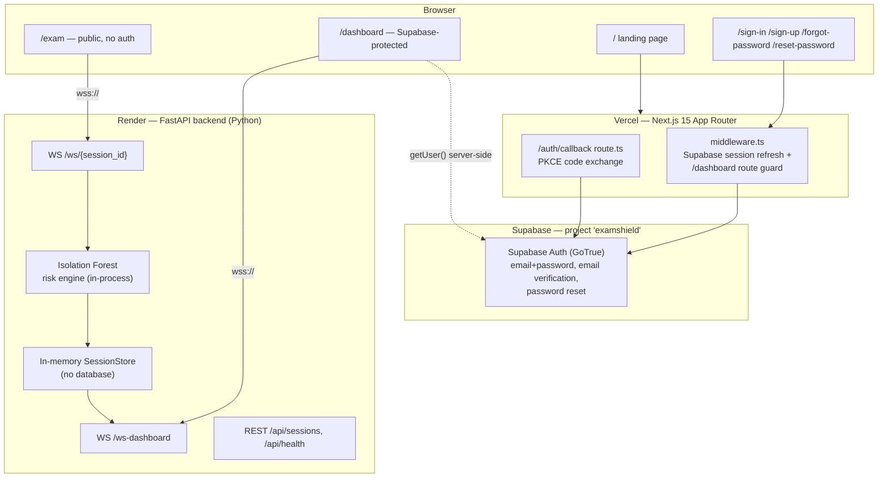

# ExamShield — Complete Project Status & Development History

*Generated from direct inspection of the `venkatcharan-ds/ExamShield` repository, its live Render/Vercel/Supabase deployments, and the connected Supabase database, as of commit `dd6594d` (2026-08-18).*

---

## 1. Project Overview

| | |
|---|---|
| **Project name** | ExamShield |
| **Tagline** | "No camera. No surveillance. Just AI that understands behavior." |
| **Origin** | Built for the **FAR AWAY 2026** hackathon (Examinations Track, India) |
| **Purpose** | A privacy-first AI exam integrity platform that detects likely cheating during online exams using *behavioral* signals instead of visual surveillance |
| **Problem being solved** | Camera-based online proctoring is exclusionary (many Indian candidates lack reliable webcams/broadband — the app cites "60% of Indian candidates"), invasive, and prone to false positives against anxious or disabled students |
| **Target users** | Two roles: **Exam candidates** (take an unauthenticated demo exam) and **Institution admins/invigilators** (log in to monitor a live risk dashboard) |
| **Core value proposition** | Replace camera/screen surveillance with keystroke-timing and interaction-pattern analysis, scored in real time by an anomaly-detection model |
| **Privacy-first approach** | The app captures only keystroke timing intervals, mouse activity counts, tab-switch/copy/paste events, and idle duration — never keystroke *content*, never video, audio, or screen captures (verified: no camera/mic/screen-capture APIs anywhere in the codebase) |

---

## 2. Current Product

From a user's perspective, ExamShield today is:

- A **marketing landing page** (`/`) explaining the privacy-first pitch, with a live illustrative event-stream widget and a "Take the Demo Exam" / "Open Dashboard" call to action.
- A **public, unauthenticated demo exam** (`/exam`) — anyone can click "Begin Exam", answer three short-answer questions, and have their typing/mouse/tab-switch behavior streamed live to the backend over a WebSocket while an Isolation-Forest model scores risk every ~3 seconds.
- An **authenticated admin dashboard** (`/dashboard`) — protected by Supabase Auth (email + password) — showing a live risk gauge, candidate info, behavior-signal breakdown, a risk-trend chart, an AI-generated "Behavior Analysis Report," an event timeline, and three one-click **demo scenarios** (Normal / Suspicious / Cheating) that simulate a candidate client-side for presentation purposes, clearly marked with a **SIMULATION MODE** badge so they are never confused with live data.
- A small **institution analytics** panel at the bottom of the dashboard with hardcoded illustrative numbers, explicitly labeled **"Demonstration Data."**

---

## 3. Current Architecture

**Frontend** — Next.js 15 (App Router), deployed on Vercel, project `exam-shield` (`exam-shield-beta.vercel.app`).
**Backend** — FastAPI (Python), deployed on Render, service `examshield-api` (`examshield-api-6fua.onrender.com`), free plan.
**Database** — Supabase Postgres exists (project `examshield`), but is used **only** for Supabase Auth's built-in `auth.users` table. The `public` schema contains **zero** application tables — exam session data is not persisted to any database.
**Authentication** — Supabase Auth, email + password only (see §5).
**ML/risk engine** — scikit-learn `IsolationForest`, trained in-process on synthetic data at server startup (see §7).
**WebSocket/live monitoring** — two raw WebSocket endpoints on the FastAPI backend, no auth on the socket layer itself (see §12).
**Deployment** — Vercel (frontend), Render (backend), Supabase (auth). Railway is a prior/backup backend deployment, explicitly preserved untouched per project history but not the active production backend.
**External services** — Supabase (auth), Render (API host), Vercel (frontend host). No email-sending service beyond Supabase's own default auth email delivery.
**Communication** — Browser ↔ Render over raw WebSocket (`wss://`) for exam telemetry and dashboard live updates; Browser ↔ Supabase over HTTPS for auth; Vercel middleware ↔ Supabase over HTTPS to validate sessions server-side on every request to `/dashboard`.

---

## 4. Technology Stack

### Frontend (`frontend/`)
| Technology | Version | Used for |
|---|---|---|
| Next.js | 15.5.19 | App Router framework, routing, middleware, server/client components |
| React | ^19.0.0 | UI rendering |
| TypeScript | ^5.7.2 | Type safety across the frontend |
| `@supabase/supabase-js` | ^2.112.3 | Supabase client SDK (auth calls) |
| `@supabase/ssr` | ^0.12.4 | Cookie-based Supabase session handling in Server Components / middleware |
| Tailwind CSS | ^3.4.17 | Utility-first styling, dark theme design tokens |
| Framer Motion | ^11.15.0 | Animations (page transitions, risk-gauge motion, alert banners) |
| Recharts | ^2.14.1 | Risk-trend area chart on the dashboard |
| lucide-react | ^0.468.0 | Icon set used throughout the UI |
| Radix UI (`react-progress`, `react-slot`) | ^1.1.1 | Low-level accessible UI primitives |
| class-variance-authority, clsx, tailwind-merge | — | Class-name composition utilities |

### Backend (`backend/`)
| Technology | Version | Used for |
|---|---|---|
| FastAPI | 0.115.5 | REST + WebSocket API framework |
| Uvicorn (`[standard]`) | 0.32.1 | ASGI server |
| websockets | 13.1 | WebSocket protocol support |
| Pydantic | 2.10.3 | Request/response schema validation (`schemas/events.py`) |
| scikit-learn | 1.5.2 | `IsolationForest` anomaly-detection model |
| NumPy | 1.26.4 | Numerical operations for feature extraction and training-data synthesis |
| pandas | 2.2.3 | Present in requirements; not directly imported in the reviewed backend modules |
| python-multipart | 0.0.17 | Form-data parsing support (FastAPI dependency) |

### Infrastructure / Platforms
| Platform | Role |
|---|---|
| Vercel | Frontend hosting, CI/CD from GitHub `main` |
| Render | Backend hosting (free web service, Oregon region) |
| Supabase | Authentication provider (Postgres project `examshield`) |
| Railway | Prior backend host, explicitly kept untouched/unused as a backup |
| GitHub | Source control (`venkatcharan-ds/ExamShield`, public repo) |

---

## 5. Authentication — Current Implementation

**Provider:** Supabase Auth, project `examshield` (`https://gimsfuhxlwkjtiytlyql.supabase.co`).
**Method:** **Email + password only.** No OAuth provider is enabled or referenced in the current codebase.

| Capability | Status | Where implemented |
|---|---|---|
| Email/password sign-up | ✅ Implemented | `frontend/app/sign-up/page.tsx` — `supabase.auth.signUp()`, collects Full Name, Email, Password, Confirm Password; stores `full_name` in Supabase user metadata |
| Email verification | ✅ Implemented | Signup never treats a session-less response as logged in (`data.user && !data.session` → "Check your email" screen); confirmation link routes through `/auth/callback` |
| Email/password sign-in | ✅ Implemented | `frontend/app/sign-in/page.tsx` — `supabase.auth.signInWithPassword()`, distinguishes "email not confirmed" from generic invalid-credentials errors |
| Forgot password | ✅ Implemented | `frontend/app/forgot-password/page.tsx` — `supabase.auth.resetPasswordForEmail()`, always shows the same generic message regardless of whether the account exists |
| Reset password | ✅ Implemented | `frontend/app/reset-password/page.tsx` — requires an active Supabase session (established via `/auth/callback`); calls `supabase.auth.updateUser({ password })`; shows "Reset link expired" if no valid session is present |
| Logout | ✅ Implemented | `frontend/components/UserMenu.tsx` — `supabase.auth.signOut()`, redirects to `/sign-in` |
| Dashboard protection | ✅ Implemented (defense in depth) | `frontend/middleware.ts` + `frontend/lib/supabase/middleware.ts` (edge-level `getUser()` re-validation, redirects unauthenticated `/dashboard` requests to `/sign-in?next=...`) **and** `frontend/app/dashboard/layout.tsx` (server-side `getUser()` guard on the route itself) |
| Auth callback | ✅ Implemented | `frontend/app/auth/callback/route.ts` — shared PKCE `code`-exchange handler for email confirmation, password reset, and (if ever re-enabled) OAuth redirects |
| User profile display | ✅ Implemented | `UserMenu.tsx` shows the signed-in user's name (from metadata) and email in the dashboard header |
| **GitHub OAuth** | ❌ **Not active** | Was implemented and later fully removed (commit `dd6594d`). No `GitHubButton`, no OAuth handler, no reference anywhere in current source. |
| **Google OAuth** | ❌ **Not active / never shipped to main** | A Google sign-in button was built in a working session but removed again in the same cleanup before merge; not present in current source. |

**Current production configuration:**
- `NEXT_PUBLIC_SUPABASE_URL` and `NEXT_PUBLIC_SUPABASE_ANON_KEY` are set on Vercel (Production) and in `frontend/.env.local` (git-ignored) for local dev.
- Supabase's **Site URL** and **Redirect URLs** (Authentication → URL Configuration) required manual dashboard changes to point at `https://exam-shield-beta.vercel.app` instead of the default `localhost:3000` — this is a Supabase Dashboard setting, not something in the codebase, and could not be verified/read back through available tooling. It should be manually re-confirmed if in doubt.
- No service-role key or any Supabase secret exists in frontend code — only the public anon/publishable key is used, which is safe by design (protected by Row Level Security).

**Client/server architecture** (`frontend/lib/supabase/`):
- `client.ts` — browser Supabase client (`createBrowserClient`)
- `server.ts` — server-side client for Server Components/Route Handlers (`createServerClient` + Next `cookies()`)
- `middleware.ts` — `updateSession()` used by root `middleware.ts` to refresh the session cookie and gate `/dashboard`

---

## 6. Exam Monitoring

All implemented in `frontend/app/exam/page.tsx`, `frontend/hooks/useBehaviorTracker.ts`, and `frontend/hooks/useWebSocket.ts`.

| Capability | Status | Detail |
|---|---|---|
| Session creation | ✅ Implemented | Client-generated `session_id` (`exam-{timestamp}-{random}`) and a hardcoded `CANDIDATE_NAME = 'Demo Candidate'` — the exam page requires **no login** |
| Typing/keystroke tracking | ✅ Implemented | `keydown`/`keyup` listeners capture timing only (`interval_since_last`); actual key *characters* are never recorded (`key: e.key.length === 1 ? 'char' : e.key`) |
| Mouse behavior | ✅ Implemented | Throttled `mousemove` listener (max 1 event/500ms) |
| Focus/blur signals | ✅ Implemented | `visibilitychange` → `tab_switch`/`focus_gain`; `window blur` → `focus_loss` |
| Tab switching | ✅ Implemented | Counted per 3-second window via `tab_switch` events, surfaced in `tab_switch_count` |
| Idle time | ✅ Implemented | 5-second idle threshold; `idle_start`/`idle_end` events feed `idle_duration` |
| Copy/paste detection | ✅ Implemented | `copy`/`paste` document listeners |
| WebSocket communication | ✅ Implemented | `useWebSocket` connects to `wss://.../ws/{session_id}`, auto-reconnects up to 5 times with exponential backoff, queues up to 5 snapshots while briefly disconnected |
| Real-time monitoring | ✅ Implemented | Behavioral snapshots flushed every 3 seconds (`useBehaviorTracker` `intervalMs = 3000`) |
| Risk calculation | ✅ Implemented | Each snapshot is scored server-side by the Isolation Forest engine (§7) |
| Events/timeline | ✅ Implemented | Backend `SessionState` accumulates a capped timeline (last 50 entries stored, last 20 returned) with severity levels |

---

## 7. AI / ML System

**File:** `backend/ml/isolation_forest.py` ("ExamShield AI Risk Engine — v5 Final (Calibrated)")

### IMPLEMENTED

| Aspect | Detail |
|---|---|
| Model | `sklearn.ensemble.IsolationForest` (`n_estimators=300`, `contamination=0.08`, `random_state=42`) |
| Training approach | Trained **in-process at server startup** on 600 *synthetic* samples spanning three legitimate typing profiles (slow/avg/fast), regenerated fresh on every server boot — not persisted, not trained on real candidate data |
| Features (8) | `typing_speed`, `average_key_interval`, `key_variance`, `mouse_activity`, `idle_duration`, `tab_switch_count`, `copy_count`, `paste_count` |
| Anomaly detection | Isolation Forest `decision_function()` output mapped through a **piecewise-linear percentile curve** (anchored at p1/p5/p10/p20/p50/p90 of the training distribution) into a 0–55 "ML score" |
| Rule boosters | A second, deterministic layer (0–84) that reacts to categorical events — e.g. 1 tab switch → 35, 2+ pastes → 84, copy+paste → 75, typing speed >800 kpm → 80 |
| Synergy stage | If ML score > 35 **and** rule score > 60, adds +10 (capped at 99) — intended to catch compounding evidence such as a long idle period followed by a paste |
| Final risk score | `max(ml_score, rule_score)` plus any synergy bonus, rounded to 1 decimal, 0–100 |
| Risk categories | Low (0–30, 🟢), Medium/Suspicious (31–70, 🟡), High (71–100, 🔴) — used consistently across backend `risk_level` and frontend UI copy |
| Explainability | `_get_flags()` produces human-readable strings (e.g. "Paste event detected", "Anomalous typing speed: 650 kpm") that populate the dashboard's timeline and "Behavior Analysis Report" |

### PLANNED / NOT IMPLEMENTED

- No persistent model store or retraining pipeline — the model is regenerated identically on every process restart.
- No per-candidate historical baseline; every session is scored against the same fixed synthetic distribution.
- No real (non-synthetic) training data has ever been used.
- No behavioral-identity / continuity concept implemented (see §19).

### Limitations (as currently built)
- Training data is synthetic, not derived from real exam-taking behavior.
- The in-memory session store means risk history resets on every backend restart/deploy (Render free tier also cold-starts after 15 minutes idle).
- No confidence intervals or model-drift monitoring.

---

## 8. Admin Dashboard

**File:** `frontend/app/dashboard/page.tsx` (~2000 lines) + `frontend/app/dashboard/layout.tsx` (auth guard).

| Feature | Status |
|---|---|
| Risk overview (gauge, current score, risk level) | ✅ Implemented |
| Active session count, alert count, status | ✅ Implemented (stat cards) |
| Candidate info card | ✅ Implemented |
| Risk trend chart (Recharts area chart) | ✅ Implemented |
| Behavior signal breakdown (typing speed, key interval, tab switches, paste/copy counts, idle time) | ✅ Implemented |
| Event timeline | ✅ Implemented (last 10 shown, animated) |
| "Behavior Analysis Report" (rule-based narrative summary + confidence label) | ✅ Implemented — generated client-side from the same feature/timeline data, not a separate ML call |
| Integrity Index (0–100 inverse-risk gauge with tiered labels) | ✅ Implemented |
| **Simulation Mode** (Normal/Suspicious/Cheating one-click demo scenarios) | ✅ Implemented, `frontend/services/demoScenarios.ts` — fully client-side, no backend involved |
| **SIMULATION MODE badge / "Simulated data" label** | ✅ Implemented — `isDemoSession = session?.session_id?.startsWith('demo-')`; header badge and candidate-card label both switch when a demo scenario is active, so it can never be confused with a live "LIVE" session |
| Live dashboard WebSocket ("LIVE" badge) | ✅ Implemented — connects to `wss://.../ws-dashboard` |
| Session Review modal (timeline replay with playback controls) | ✅ Implemented |
| "Sample Institution Analytics" section | ✅ Implemented, explicitly labeled **"Demonstration Data"** — hardcoded illustrative numbers (`INST_DATA` constant: 1,248 candidates, 1,089 verified, etc.), never fed by real state |
| Authentication/protection | ✅ Implemented (see §5) |
| User profile/logout menu | ✅ Implemented (`UserMenu.tsx`) |

**Known architectural note:** the dashboard only tracks a single "currently displayed" session — it shows whichever session most recently broadcast an update, not a multi-candidate roster. This is by design for the current MVP scope, not a bug, but is worth knowing before treating this as a real invigilation tool.

---

## 9. Student Exam Experience

Actual current flow, verified against the code (no assumptions):

1. **Landing page** (`/`) — marketing pitch, "Take the Demo Exam" button.
2. **No signup/signin step.** `/exam` is fully public; there is no candidate authentication anywhere in the current implementation.
3. **Pre-exam screen** — shows exam details (45 minutes, 3 questions), a privacy notice, and the (hardcoded) candidate name "Demo Candidate"; "Begin Exam" button.
4. **Active exam** — three free-text questions rendered from a hardcoded array; a connection-status indicator ("Monitoring" once the WebSocket is live); a 45-minute countdown timer; a footer note linking to the admin dashboard.
5. **Behavioral monitoring** runs continuously in the background per §6, invisibly to the student — no visible score, no camera, no recording indicator beyond the "Monitoring" text.
6. **Submission** — "Submit Exam" shows a confirmation screen with the session ID's last 10 characters and a link to "View Admin Dashboard."

---

## 10. Privacy & Security

| Mechanism | Status |
|---|---|
| No camera access | ✅ — no `getUserMedia`/video APIs anywhere in the repo |
| No screen recording | ✅ — no screen-capture APIs |
| No facial recognition | ✅ — not present |
| No microphone access | ✅ — not present |
| Behavioral signals only | ✅ — keystroke timing, mouse activity counts, tab-switch/copy/paste events, idle duration (§6) |
| Actual keystroke content never captured | ✅ — `useBehaviorTracker.ts` explicitly replaces real characters with the literal string `'char'` before it ever leaves the browser |
| Authentication | ✅ Supabase Auth, email+password, server-side session verification on protected routes (§5) |
| Environment variable handling | ✅ Public/safe values (`NEXT_PUBLIC_SUPABASE_URL`, `NEXT_PUBLIC_SUPABASE_ANON_KEY`, `NEXT_PUBLIC_WS_URL`, `NEXT_PUBLIC_API_URL`) are the only ones the frontend ships with; no secret keys were found committed anywhere in the repository (verified via source search) |
| Secret handling | ✅ No Supabase service-role key, no Clerk secret, no OAuth client secret exists in the codebase; `.env.local` is git-ignored |
| CORS | ✅ Backend restricts allowed origins via the `ALLOWED_ORIGINS` env var (`backend/main.py`), `allow_credentials=False`, methods limited to `GET, POST` |
| Password handling | ✅ Never stored or transmitted by the app itself — delegated entirely to Supabase Auth; no custom password hashing exists |

**Not implemented:** Row Level Security policies (no custom tables exist to apply them to), rate limiting beyond Supabase's own defaults, audit logging, and WebSocket-level authentication (see §12 limitations).

---

## 11. Database

**Project:** Supabase `examshield` (`gimsfuhxlwkjtiytlyql`), region `ap-south-1`, plan: free, status: `ACTIVE_HEALTHY`.

**Purpose:** Authentication only.

**Tables in the `public` schema:** **none.** Verified directly via `list_tables` against the live project — zero application-defined tables exist. No exam-session, risk-history, or user-profile tables have been created.

**Auth usage:** Supabase's built-in `auth.users` table stores registered admin accounts (email, hashed password, `full_name` in `raw_user_meta_data`, `email_confirmed_at`). At time of writing this table contains 2 rows (test accounts from development/verification).

**RLS policies:** none — there is nothing to apply them to, since no custom tables exist.

**Other Supabase projects in the same account** (`vitaledge`, `signal-platform`) belong to unrelated projects and were explicitly left untouched throughout ExamShield's development, per repeated instruction and verification.

---

## 12. Backend / API

| | |
|---|---|
| **Framework** | FastAPI (Python), `backend/main.py` |
| **Production URL** | `https://examshield-api-6fua.onrender.com` (Render service `examshield-api`, confirmed live) |
| **Health endpoint** | `GET /api/health` → `{"status":"ok","model_trained":bool,"active_sessions":int,"dashboard_listeners":int}` |
| **REST endpoints** | `GET /api/sessions`, `GET /api/sessions/{session_id}`, `POST /api/sessions/{session_id}/end`, `GET /` (root info) |
| **WebSocket endpoints** | `WS /ws/{session_id}` (exam client), `WS /ws-dashboard` (admin dashboard listener) |
| **CORS** | Configured via `ALLOWED_ORIGINS` env var; no credentials, `GET`/`POST` only (note: this doesn't restrict the WebSocket endpoints, which have no origin or auth check at all — see limitation below) |
| **Deployment platform** | Render, free web-service plan, Oregon region, auto-deploy from `main` |
| **Environment variables** | `ALLOWED_ORIGINS` (comma-separated origins), `PYTHON_VERSION` (Render build config) — no secrets required |
| **Frontend↔backend communication** | Browser connects directly to the Render WebSocket/REST URLs via `NEXT_PUBLIC_WS_URL`/`NEXT_PUBLIC_API_URL`; no server-side proxying through Vercel |

**Known limitation:** `/ws/{session_id}` and `/ws-dashboard` accept any connection unconditionally — there is no authentication, token, or origin check on the WebSocket layer itself. Anyone who knows (or guesses) a session ID, or the dashboard socket URL, can connect and see/send data. This was a known, accepted tradeoff for the hackathon MVP scope and has not been revisited.

**render.yaml note:** the repository's `backend/render.yaml` declares `healthCheckPath: /api/health`, but the live Render service's own configuration shows an empty `healthCheckPath` — the file isn't being applied as a Blueprint sync. Cosmetic/operational drift, not a functional issue (the service responds to health checks regardless).

---

## 13. Deployment Status

| Component | Platform | Status | URL |
|---|---|---|---|
| Frontend | Vercel (project `exam-shield`) | **READY**, latest production deployment for commit `dd6594d` | `https://exam-shield-beta.vercel.app` |
| Backend | Render (service `examshield-api`, free plan) | Live, not suspended | `https://examshield-api-6fua.onrender.com` |
| Auth database | Supabase (`examshield`) | `ACTIVE_HEALTHY` | `https://gimsfuhxlwkjtiytlyql.supabase.co` |
| Backup backend (unused) | Railway | Preserved untouched, not the active target | — |

**Current environment variables (values not reproduced here):**
- Vercel Production: `NEXT_PUBLIC_SUPABASE_URL`, `NEXT_PUBLIC_SUPABASE_ANON_KEY`, `NEXT_PUBLIC_WS_URL`, `NEXT_PUBLIC_API_URL`
- Render: `ALLOWED_ORIGINS`, `PYTHON_VERSION`

**Latest relevant commit:** `dd6594d` — "Simplify authentication to email and password" (2026-08-18), currently deployed to production on Vercel.

---

## 14. Development History

Reconstructed from `git log` (8 commits total) and verified deployment records — every entry below is directly traceable to a commit or a deployment event.

| Date | Commit | Milestone |
|---|---|---|
| 2026-06-14 | `a2403e4` | **Initial ExamShield MVP** — FAR AWAY 2026 hackathon submission. Landing page, exam page, dashboard, FastAPI backend, Isolation Forest engine, WebSocket monitoring — the whole MVP shipped in one commit. |
| 2026-06-14 | `af748e3` | Fix Render Python version (early Render deploy attempts) |
| 2026-06-14 | `c610912` | Move `runtime.txt` to repo root for Render |
| 2026-06-14 | `ee6240f` | Update deployment links and Railway configuration |
| 2026-06-15 | `1b7604c` | Fix Railway production API and WebSocket URLs |
| 2026-08-17 | `efdd257` | **Simulation Mode indicator** — added the `SIMULATION MODE` badge/label distinguishing demo scenarios from live dashboard data |
| 2026-08-18 | `d2286e2` | **Add Supabase authentication** — full email+password (+ GitHub/Google OAuth, later removed) auth system: sign-up, sign-in, forgot/reset password, email verification, `/dashboard` protection, middleware, `/auth/callback` |
| 2026-08-18 | `dd6594d` | **Simplify authentication to email and password** — removed GitHub and Google OAuth UI/handlers entirely, leaving email+password as the sole auth method (current `main` HEAD) |

**Also completed (infrastructure work, not separate commits — verified via live platform inspection, not git):**
- Migration of the live backend target from Railway to Render (Render service `examshield-api` created and made the active production backend; Railway kept as an untouched backup).
- Creation of a dedicated Supabase project (`examshield`) separate from the account's other unrelated projects (`vitaledge`, `signal-platform`), which were explicitly left untouched throughout.
- Supabase Auth URL Configuration (Site URL / Redirect URLs) updated to point at the production Vercel domain instead of the default `localhost:3000` — a dashboard-only change, not reflected in git history.
- Diagnosis and recovery of a brief production outage caused by deploying the Supabase-auth commit before its required Vercel environment variables were configured.

---

## 15. Current Status

| Feature | Status | Notes |
|---|---|---|
| Landing page | ✅ COMPLETE | `/` |
| Public demo exam | ✅ COMPLETE | `/exam`, no auth required |
| Behavioral tracking (keystroke/mouse/tab/idle/copy-paste) | ✅ COMPLETE | `useBehaviorTracker.ts` |
| Exam WebSocket | ✅ COMPLETE | `/ws/{session_id}`, auto-reconnect |
| Isolation Forest risk engine | ✅ COMPLETE | Synthetic-trained, in-process |
| Rule-based risk boosters + synergy | ✅ COMPLETE | `ml/isolation_forest.py` |
| Admin dashboard (live view) | ✅ COMPLETE | `/dashboard` |
| Dashboard WebSocket | ✅ COMPLETE | `/ws-dashboard` |
| Simulation Mode + badge | ✅ COMPLETE | Client-side only, clearly labeled |
| Institution analytics panel | ✅ COMPLETE (demo data) | Explicitly labeled "Demonstration Data" |
| Supabase email/password auth | ✅ COMPLETE | Sign-up, sign-in, verification, forgot/reset password, logout |
| Dashboard route protection | ✅ COMPLETE | Middleware + server-side layout guard |
| GitHub OAuth | ❌ NOT IMPLEMENTED | Built, then deliberately removed |
| Google OAuth | ❌ NOT IMPLEMENTED | Built, then deliberately removed before merge |
| Persistent database for exam/session data | ❌ NOT IMPLEMENTED | In-memory only; resets on backend restart |
| WebSocket authentication | ❌ NOT IMPLEMENTED | Sockets accept any connection |
| Row Level Security policies | ❌ NOT IMPLEMENTED | No custom tables exist to secure |
| Behavioral baseline / identity continuity | 🔵 PLANNED | Concept only — see §19 |
| Multi-candidate dashboard roster | 🔵 PLANNED | Dashboard currently shows one session at a time |
| Model retraining on real data | 🔵 PLANNED | Currently synthetic-only |

---

## 16. What We Have Built vs. What We Planned

### A. Actually Implemented
- Full landing page, public demo exam, and admin dashboard (Next.js 15 App Router)
- Real-time behavioral tracking (keystroke timing, mouse activity, tab switches, idle time, copy/paste) over WebSocket
- A calibrated three-stage risk-scoring pipeline (Isolation Forest + rule boosters + synergy bonus) with explainable flags
- FastAPI backend deployed on Render, with health/session REST endpoints and two WebSocket endpoints
- Supabase Auth-based admin authentication: sign-up, email verification, sign-in, forgot/reset password, logout, and protected `/dashboard` (middleware + server-side guard)
- A clearly-labeled Simulation Mode for live demos, with a badge that prevents it from ever being mistaken for real data
- End-to-end production deployment across Vercel, Render, and Supabase, with the Railway backup preserved untouched

### B. Ideas / Features Discussed but NOT Implemented
- GitHub OAuth sign-in (built, then intentionally removed — see commit `dd6594d`)
- Google OAuth sign-in (built in a working session, removed again before merge — never in `main`)
- Persistent storage of exam sessions, risk history, or candidate identity in a database (currently in-memory only)
- WebSocket-level authentication/authorization
- Row Level Security policies (no tables exist yet to need them)
- Multi-candidate / multi-session dashboard roster view
- Model retraining on real (non-synthetic) behavioral data
- **Behavioral Baseline / Identity Continuity** concept (§19) — discussed as a future direction, not built
- Investigation panel, explainable-evidence review UI beyond the existing timeline/report (§19)

---

## 17. Current Limitations / Known Issues

1. **No persistence.** All session, risk-history, and timeline data lives in a Python process's memory (`backend/models/session.py`). A backend restart or Render's free-tier cold start after 15 minutes idle wipes all state.
2. **No WebSocket authentication.** Both `/ws/{session_id}` and `/ws-dashboard` accept any connection with no token or origin check.
3. **Single-session dashboard.** The dashboard displays whichever session most recently broadcast an update — it is not a true multi-candidate monitoring console.
4. **Synthetic training data only.** The ML model has never seen real exam-taking behavior.
5. **`render.yaml` drift.** The file's `healthCheckPath` isn't reflected in the live Render service's own settings (cosmetic, not functional).
6. **Stray fallback URLs.** `frontend/hooks/useWebSocket.ts` and `frontend/next.config.js` still contain hardcoded Railway URLs as fallback defaults (used only if `NEXT_PUBLIC_WS_URL`/`NEXT_PUBLIC_API_URL` are unset — Vercel Production has both set correctly, so these fallbacks are dormant, but they're worth cleaning up).
7. **Supabase Auth URL Configuration is dashboard-only state.** It isn't version-controlled or verifiable through code; if it ever drifts back to a `localhost` Site URL, email confirmation links will misdirect again.

---

## 18. Next Development Roadmap

Based strictly on the current codebase and the gaps identified above:

1. **Persist exam sessions to Supabase Postgres** — replace the in-memory `SessionStore` with real tables (sessions, risk_history, timeline), so data survives restarts and supports a real multi-candidate dashboard.
2. **Add WebSocket authentication** — require the admin dashboard socket to present a valid Supabase session token; consider signed, time-limited tokens for exam-client sockets.
3. **Multi-candidate dashboard roster** — let an admin see and switch between all active sessions instead of only the most recently updated one.
4. **Real behavioral training data** — begin collecting anonymized, consented behavioral data to replace/augment the synthetic training set.
5. **Clean up dormant Railway fallback URLs** in `useWebSocket.ts` and `next.config.js` now that Render is the sole production backend.
6. 🔵 **PLANNED: Behavioral Baseline / Identity Continuity** (see §19) — not started; would require the persistence layer above as a prerequisite.

---

## 19. Hackathon-Winning Direction (PLANNED — not implemented)

> **From AI cheating detection → privacy-preserving behavioral identity verification.**

Everything in this section is a **proposed future direction only.** None of it exists in the current codebase; it is documented here purely to record the discussed evolution.

| Concept | Description | Status |
|---|---|---|
| **Behavioral baseline** | Build a per-candidate profile of typical typing rhythm and interaction patterns over multiple sessions, rather than scoring every session against one fixed synthetic distribution | 🔵 PLANNED |
| **Personal behavioral similarity** | Compare a live session's features against that specific candidate's own historical baseline (not just population norms) to detect "this doesn't look like how *this* person usually types" | 🔵 PLANNED |
| **Identity continuity** | Use behavioral similarity as a lightweight, privacy-preserving signal that the same person is present throughout an exam (or across multiple exams), without any biometric/facial data | 🔵 PLANNED |
| **Investigation panel** | A dedicated admin UI for reviewing *why* a session was flagged — deeper than the current timeline/report, with side-by-side baseline-vs-session comparisons | 🔵 PLANNED |
| **Explainable risk evidence** | Extend the current flag system (`_get_flags()`) into a structured, auditable evidence trail suitable for academic-integrity review processes | 🔵 PLANNED |
| **Privacy advantage** | The pitch: this entire identity-continuity approach would still require zero camera, zero biometric enrollment, and zero content capture — differentiating it from both traditional proctoring *and* typical behavioral-biometric vendors that do collect more invasive data | 🔵 PLANNED (framing/positioning, not code) |

---

## 20. Final Project Snapshot

**What ExamShield is today:** A working, deployed, privacy-first exam-integrity demo — a public exam page that streams real behavioral telemetry over WebSocket to a FastAPI backend, where a calibrated Isolation Forest + rule-based engine scores risk in real time, visualized on a Supabase-authenticated live admin dashboard.

**What is working today:** The full pipeline is live and verified end-to-end in production — landing page, public exam, WebSocket monitoring, ML risk scoring, live dashboard, Simulation Mode (clearly distinguished from live data), and email+password authentication protecting the dashboard.

**What makes it different:** No camera, no screen recording, no microphone, no facial recognition — integrity signal comes entirely from typing rhythm, mouse activity, and focus/attention events, explicitly designed for low-bandwidth, low-hardware environments.

**What we should build next:** Persistent storage for sessions (the single biggest gap enabling everything else), WebSocket authentication, and — as the headline differentiator — the planned behavioral-baseline/identity-continuity system that would turn ExamShield from a one-shot anomaly detector into a genuine, privacy-preserving identity-continuity signal.
